# Real-time conversation - Architecture & Scenarios Guide

> A deep dive into real-time audio streaming, transcription handling, UI components, and the art of keeping Gemini responsive.

## Table of Contents

- [Overview](#overview)
- [System Architecture](#system-architecture)
- [User Interface Components](#user-interface-components)
- [Audio Streaming Modes](#audio-streaming-modes)
- [The Transcription Challenge](#the-transcription-challenge)
- [Flush Mechanism: Keeping Long Sessions Alive](#flush-mechanism-keeping-long-sessions-alive)
- [VAD (Voice Activity Detection)](#vad-voice-activity-detection)
- [Configuration Reference](#configuration-reference)
- [Quick Decision Guide](#quick-decision-guide)

---

## Overview

This application implements a **real-time bidirectional voice conversation** with Google's Gemini Live API. The key challenge? Gemini processes audio in **turns**, but humans don't always speak in neat, short sentences.

```
┌─────────────┐      WebSocket       ┌─────────────┐      Gemini API       ┌─────────────┐
│   Browser   │ ◄──────────────────► │   FastAPI   │ ◄───────────────────► │   Gemini    │
│  (VAD+Mic)  │    Audio + JSON      │   Backend   │    Audio + Events     │  Live API   │
└─────────────┘                      └─────────────┘                       └─────────────┘
```

### The Core Problem We Solve

When a user speaks for **extended periods** (15+ seconds), Gemini accumulates audio without processing it. This leads to:

- 📉 Delayed or lost transcriptions
- 🐢 Sluggish response times
- 😵 Degraded conversation quality

**Our solution:** Periodic flush + streaming modes to keep the conversation flowing.

---

## System Architecture

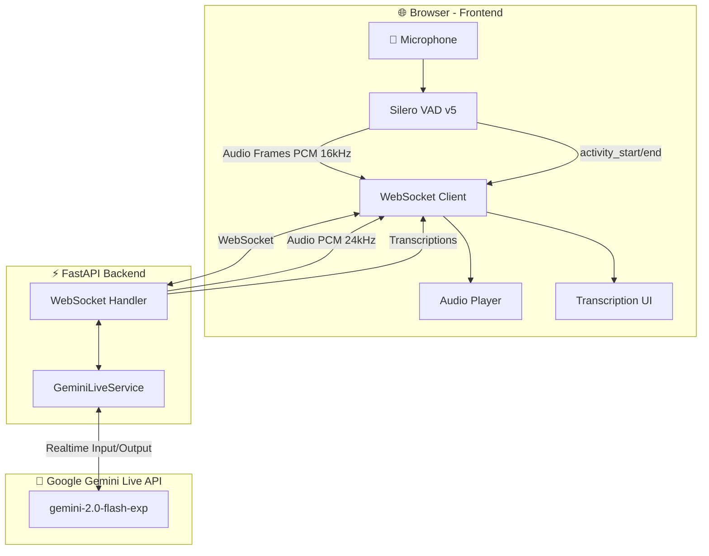

### Message Protocol

| Direction | Type | Payload | Description |
|-----------|------|---------|-------------|
| 🔼 Client→Server | `activity_start` | `{}` | VAD detected speech start |
| 🔼 Client→Server | `activity_end` | `{}` | VAD detected speech end |
| 🔼 Client→Server | `activity_cancel` | `{}` | False positive (very short speech) |
| 🔼 Client→Server | Binary | PCM audio | 16kHz mono audio frames |
| 🔽 Server→Client | `input_transcription` | `{text: "..."}` | What the user said |
| 🔽 Server→Client | `output_transcription` | `{text: "..."}` | What Gemini said |
| 🔽 Server→Client | `model_state` | `{state: "listening\|thinking\|speaking"}` | Model state |
| 🔽 Server→Client | `turn_complete` | `{}` | Conversation turn finished |
| 🔽 Server→Client | Binary | PCM audio | 24kHz mono audio response |

---

## User Interface Components

The application features a modern, responsive UI designed for real-time voice conversation with visual feedback.

### Main UI Layout

```
┌─────────────────────────────────────────────────────────────────┐
│                          Card Header                            │
│  Title │ Connection Info │ Timer │ Turns │ Connect │ Settings   │
├─────────────────────────────────────────────────────────────────┤
│                   Reconnect Banner (if needed)                  │
├───────────────────────────────┬─────────────────────────────────┤
│         User Panel            │          Gemini Panel           │
│        🎧 Listening           │          🤔 Thinking            │
│        ┌──────────┐           │          ┌──────────┐           │
│        │  Audio   │           │          │  Audio   │           │
│        │Visualizer│           │          │Visualizer│           │
│        │(10 bars) │           │          │(10 bars) │           │
│        └──────────┘           │          └──────────┘           │
│      [Audio Level Bar]        │        [Audio State]            │
├───────────────────────────────┴─────────────────────────────────┤
│                        Chat Conversation                        │
│  User: "Hello, how are you today?"                    3:45 PM   │
│  Gemini: "I'm doing well, thank you!"                 3:45 PM   │
└─────────────────────────────────────────────────────────────────┘
```

### UI Components Overview

#### 1. Video Call Layout (Dual-Panel Design)

##### User Panel (Left)

- State badge: 🎧 Listening or 🎤 Speaking
- Real-time audio visualizer with 10 animated bars
- Audio level indicator (0-100%)
- Pre-speech buffer visualization

##### Gemini Panel (Right)

- State badge: 🎧 Listening, 🤔 Thinking, or 🗣️ Speaking
- Real-time output audio visualizer
- Audio playback state indicator

#### 2. Settings Modal

Accessible via ⚙️ button with three configurable toggles:

| Setting | Description | Default | UI Control |
|---------|-------------|---------|------------|
| **Real-time streaming** | Send audio frames immediately vs batch at end | ✅ ON | Toggle switch |
| **Periodic flush** | Force processing every 15s during long speech | ✅ ON | Toggle switch |
| **Side chat panel** | Toggle chat between bottom (28vh) and side (350px) | ❌ OFF | Toggle switch |

##### Features

- Smooth slide-in animation from top-right
- Click outside to close
- Animated toggle switches with active/inactive states
- Settings persist in UI state (not localStorage)

#### 3. Chat Conversation Panel

Two layout modes available:

##### Bottom Layout (Default)

- 28vh height
- Full width below video panels
- Good for desktop workflows

##### Side Layout (Optional)

- 350px width on desktop
- Converts to bottom on mobile (<968px)
- Video-call style interface

##### Message Features

- User messages: Blue bubbles, right-aligned
- AI messages: White bubbles, left-aligned
- Timestamps (12-hour format)
- Auto-scroll to latest
- Incremental text accumulation per turn
- Smooth slide-in animations
- Auto-trim to 50 messages max

#### 4. Connection Stats & Monitoring

Header displays real-time metrics:

- **Reconnections**: Counter increments on each reconnect attempt
- **Connected Time**: Live timer in MM:SS format
- **Turns**: Conversation turn counter with color indicators:
  - 0-9 turns: Normal (inherit color)
  - 10-14 turns: Yellow warning
  - 15+ turns: Red alert (consider refresh)

#### 5. Status Indicators

**Connection Status Dot** with contextual animations:

| State | Color | Animation |
|-------|-------|-----------|
| Disconnected | 🔴 Red | Slow pulse (2s) |
| Connecting | 🟡 Yellow | Medium pulse |
| Connected | 🟢 Green | No animation |
| Reconnecting | 🟠 Orange | Fast pulse |
| Thinking | 🔵 Cyan | Scale pulse (0.5s) |
| Speaking | 🟣 Purple | Bounce pulse (0.3s) |

##### State Badges

- User: "🎧 Listening" | "🎤 Speaking"
- Gemini: "⏳ Waiting" | "🎧 Listening" | "🤔 Thinking..." | "🗣️ Speaking"

#### 6. Automatic Reconnection System

When connection drops, displays banner:

```
┌─────────────────────────────────────────────────┐
│ 🔄 Reconnecting in 5s... (Attempt 3)            │
└─────────────────────────────────────────────────┘
```

##### Features

- Exponential backoff with jitter (1s → 2s → 4s → 8s... max 30s)
- Max 10 reconnection attempts
- Visual banner with countdown
- Preserves turn count across reconnections
- Auto-hides on successful reconnection
- Spinner animation during reconnect

#### 7. Audio Visualizers

##### Input Visualizer (User Panel)

- 10 gradient bars (blue theme)
- Driven by VAD speech probability (0-1)
- Random variation for visual effect
- Height range: 4-140px
- Updates every frame (~32ms)

##### Output Visualizer (Gemini Panel)

- 10 gradient bars (purple theme)
- Driven by Web Audio API frequency analysis
- Real-time audio playback visualization
- FFT size: 256
- Resets to 4px when silent

#### 8. Responsive Design

##### Desktop (≥968px)

- Two-column video call layout (grid)
- Side chat option available (350px)
- Settings modal: 320px width, top-right positioned

##### Mobile (<968px)

- Single-column video call (stacked)
- Chat always at bottom (30vh)
- Side layout auto-converts to bottom
- Settings modal: Full-width with margins
- Reduced visualizer heights

### UI State Management

```javascript
// Connection State
let ws = null;
let shouldReconnect = false;
let reconnectAttempts = 0;
let connectionStartTime = null;
let connectionTimer = null;

// Audio State
let vadInstance = null;
let isSpeaking = false;
let audioQueue = [];
let isPlaying = false;
let outputAudioContext = null;
let outputAnalyser = null;

// Configuration State (Toggleable in Settings)
let streamingEnabled = true;  // Real-time streaming
let flushEnabled = true;      // Periodic flush
// Chat layout managed via CSS classes

// Transcription State
let currentUserMessage = null;  // Accumulator for current turn
let currentAiMessage = null;     // Accumulator for current turn
let turnsCount = 0;              // Session turn counter

// VAD Pre-speech Buffer
let preSpeechBuffer = [];  // Circular buffer for 400ms (~12 frames)
let lastFlushTime = null;   // Timestamp for periodic flush
```

### Visual Design System

#### Color Palette

```css
--primary-blue: #3b82f6   /* User accent */
--ai-accent: #8b5cf6      /* Gemini accent */
--success-green: #28a745   /* Connected, active */
--warning-yellow: #ffc107  /* Connecting, warnings */
--danger-red: #dc3545     /* Errors, disconnected */
--bg-dark: #0f172a        /* Main background */
--panel-dark: #1e293b     /* Panel backgrounds */
```

#### Animations

- Connect button: 0.3s ease transitions
- Settings modal: Cubic-bezier slide-in with bounce
- Chat messages: Fade + slide-up (0.3s)
- Visualizer bars: 0.1s ease transitions
- Status dots: Contextual pulse/scale/bounce

#### Gradients

- User visualizer: `linear-gradient(to top, #3b82f6, #60a5fa)`
- AI visualizer: `linear-gradient(to top, #8b5cf6, #a78bfa)`
- Connect button: `linear-gradient(135deg, #3b82f6, #0ea5e9)`
- Audio level: `linear-gradient(to right, #28a745, #ffc107, #dc3545)`

---

## Audio Streaming Modes

The app supports **two distinct modes** for sending audio to Gemini. Each has trade-offs depending on your use case.

### Mode 1: Real-Time Streaming (Default) 📡

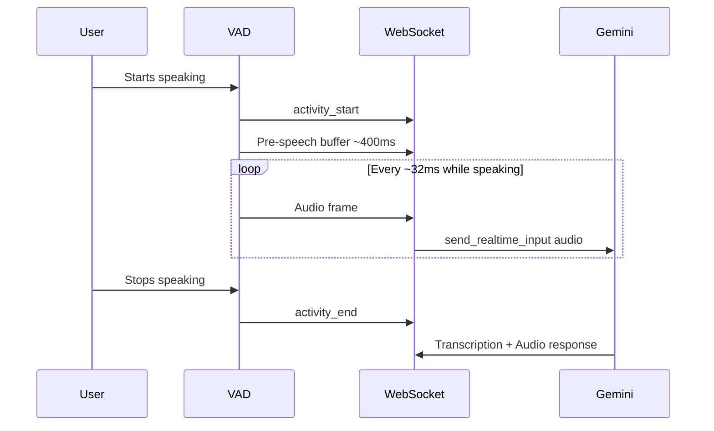

**How it works:**

- Audio frames sent **immediately** as they're captured
- Pre-speech buffer (400ms) ensures no word beginnings are lost
- Flow: `activity_start` → stream frames → `activity_end`

| ✅ Pros | ❌ Cons |
|---------|---------|
| Lower latency for processing | Higher bandwidth usage |
| Progressive transcription | More WebSocket messages |
| Natural conversation flow | Requires stable connection |
| Pre-speech capture prevents lost words | — |

**Best for:** Interactive conversations where real-time feedback is needed.

---

### Mode 2: End-of-Speech Batch Mode 📦

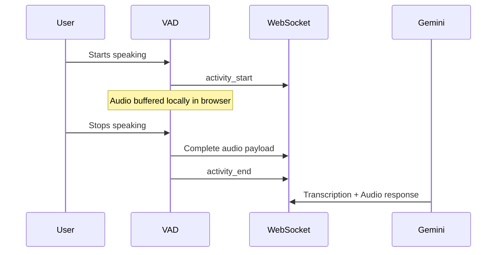

**How it works:**

- Audio is buffered in the browser during speech
- Single payload sent when speech ends
- Simpler flow but higher latency

| ✅ Pros | ❌ Cons |
|---------|---------|
| Lower network overhead | Higher perceived latency |
| Fewer WebSocket messages | No progressive transcription |
| Works on unstable connections | Larger single payloads |
| Simpler implementation | User waits longer for response |

**Best for:** Unreliable networks, batch processing scenarios.

---

### Side-by-Side Comparison

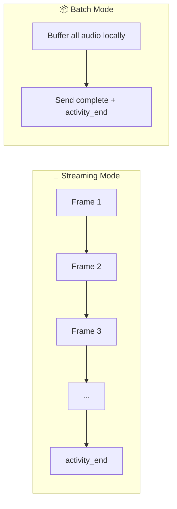

---

## The Transcription Challenge

### How Gemini Delivers Transcriptions

Transcriptions arrive as **incremental chunks**, not complete sentences. This is important to understand!

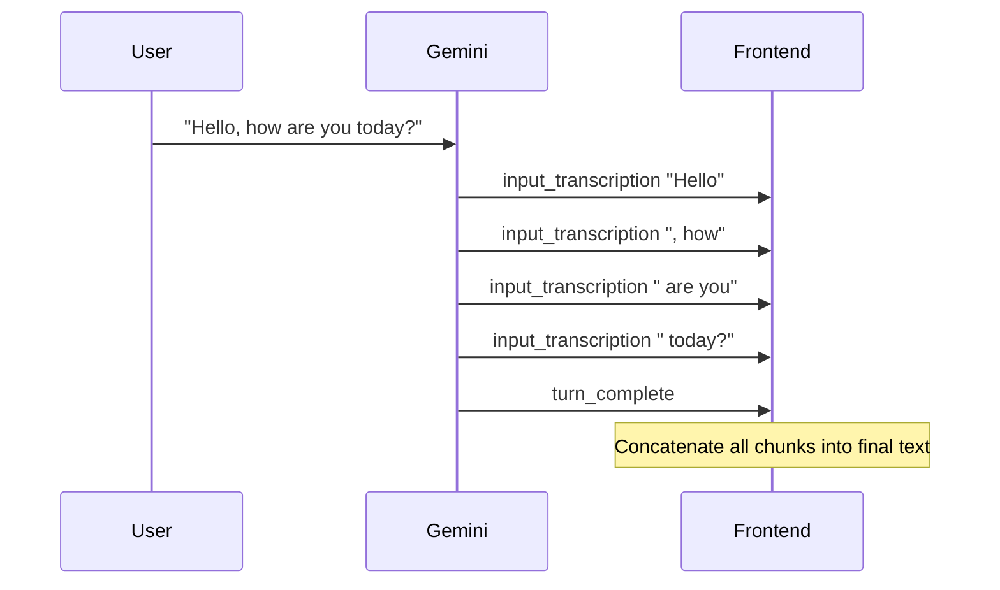

### Frontend Accumulation Strategy

```javascript
let currentInputTranscription = '';
let currentOutputTranscription = '';

function appendTranscription(type, text) {
    if (type === 'input') {
        currentInputTranscription += text;  // Accumulate chunks
        updateInputUI(currentInputTranscription);
    } else {
        currentOutputTranscription += text;
        updateOutputUI(currentOutputTranscription);
    }
}

// On turn_complete event:
function finalizeTranscriptions() {
    // Save to history if needed
    currentInputTranscription = '';   // Reset for next turn
    currentOutputTranscription = '';
}
```

### The Long Speech Problem 😰

When users speak for extended periods without natural pauses:

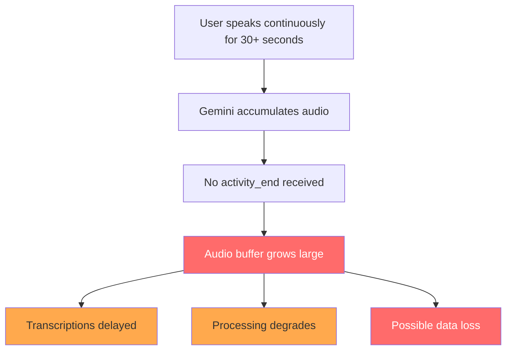

**Why this happens:**

1. Gemini waits for `activity_end` to process accumulated audio
2. Large audio buffers can cause processing issues
3. Transcription pipeline may drop chunks under load
4. Memory pressure increases on both client and server

---

## Flush Mechanism: Keeping Long Sessions Alive

### The Solution: Periodic Flush 🔄

Force Gemini to process audio every **15 seconds** of continuous speech by sending `activity_end` + `activity_start` in sequence.

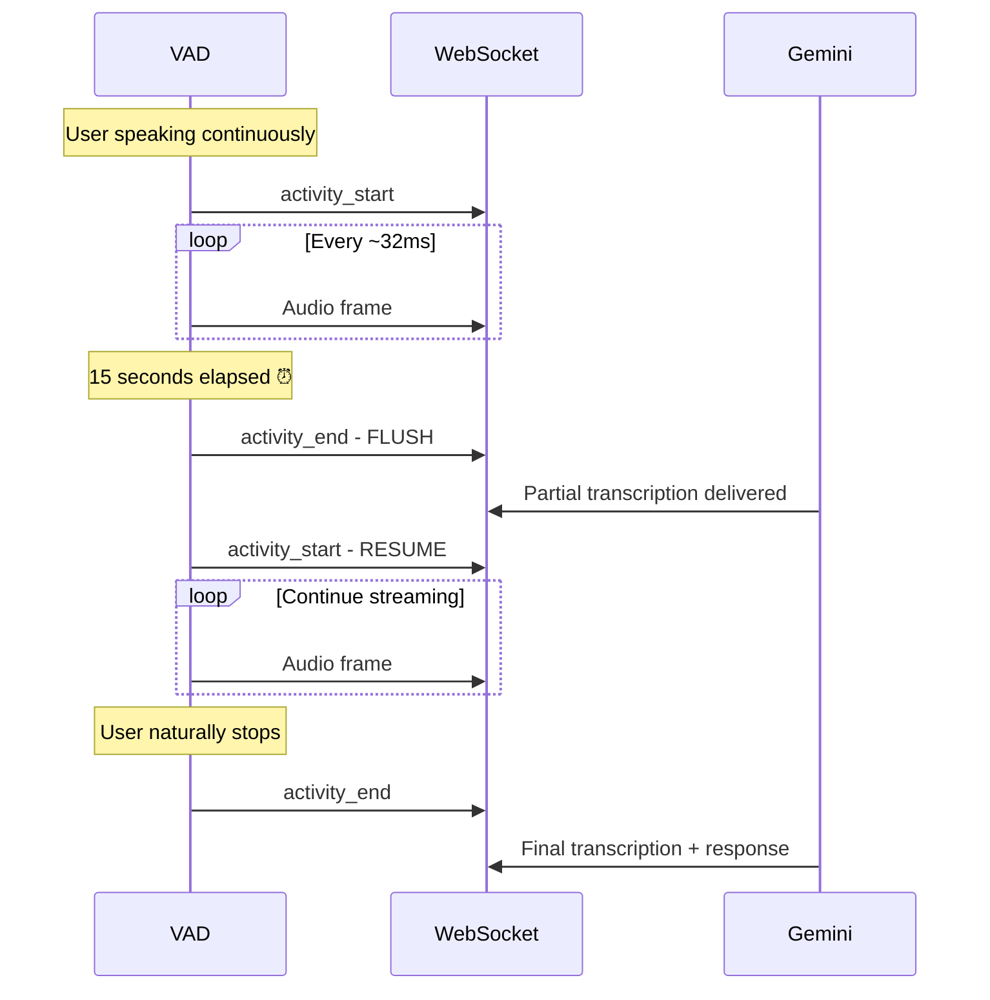

### Implementation Details

```javascript
const FLUSH_INTERVAL_MS = 15000;  // 15 seconds
let lastFlushTime = null;
let speechStartTime = null;

function performPeriodicFlush() {
    if (ws && ws.readyState === WebSocket.OPEN) {
        console.log('Periodic flush: activity_end + activity_start');

        // Force Gemini to process accumulated audio
        ws.send(JSON.stringify({ type: 'activity_end' }));

        // Immediately resume listening (no gap in audio capture)
        ws.send(JSON.stringify({ type: 'activity_start' }));

        lastFlushTime = Date.now();
    }
}

// In the VAD onFrameProcessed callback:
function onFrameProcessed(probs, frame) {
    // ... send audio frame ...

    // Check if flush is needed
    if (flushEnabled && isSpeaking && lastFlushTime) {
        const timeSinceLastFlush = Date.now() - lastFlushTime;
        if (timeSinceLastFlush >= FLUSH_INTERVAL_MS) {
            performPeriodicFlush();
        }
    }
}
```

### Flush Trade-offs

| With Flush ✅ ON | Without Flush ❌ OFF |
|------------------|----------------------|
| ✅ Reliable transcriptions | ❌ May lose transcriptions |
| ✅ Consistent response times | ❌ Delayed responses |
| ⚠️ May create "artificial" turn boundaries | ✅ Natural turn boundaries |
| ⚠️ Slight interruption in flow | ✅ Uninterrupted speech flow |

### When to Use Flush

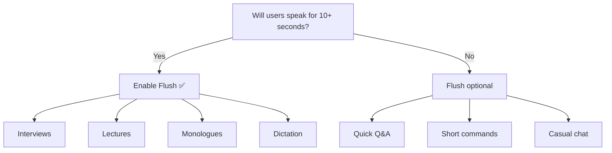

**Recommendation:** Keep flush **ON** for sessions where users may speak for extended periods.

---

## VAD (Voice Activity Detection)

We use **Silero VAD v5** running in the browser via WebAssembly. This provides client-side voice detection without server round-trips.

### Configuration

```javascript
vadInstance = await vad.MicVAD.new({
    model: "v5",  // Silero v5 - most accurate

    // Detection thresholds
    positiveSpeechThreshold: 0.5,   // Probability to START detecting
    negativeSpeechThreshold: 0.35,  // Probability to STOP detecting

    // Timing parameters
    redemptionMs: 600,      // Wait 600ms before confirming speech end
    preSpeechPadMs: 400,    // Capture 400ms BEFORE speech detected
    minSpeechMs: 200,       // Minimum speech duration (filters noise)
});
```

### Pre-Speech Buffer: Don't Lose the Beginning! 🎯

The VAD fires `onSpeechStart` **after** detecting speech, but we need the audio from **before** detection to avoid cutting off word beginnings.

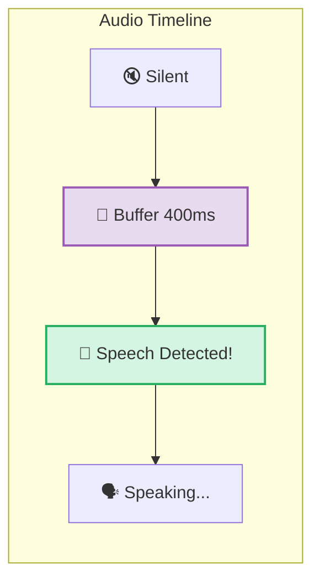

**Solution: Circular Buffer**

```javascript
const PRE_SPEECH_BUFFER_MS = 400;
const VAD_SAMPLE_RATE = 16000;
const VAD_FRAME_SAMPLES = 512;
const PRE_SPEECH_FRAMES = Math.ceil(
    (PRE_SPEECH_BUFFER_MS / 1000) * VAD_SAMPLE_RATE / VAD_FRAME_SAMPLES
);  // ≈ 12 frames

let preSpeechBuffer = [];

// On every frame (when NOT speaking):
if (!isSpeaking) {
    preSpeechBuffer.push(new Float32Array(frame));  // Clone frame
    while (preSpeechBuffer.length > PRE_SPEECH_FRAMES) {
        preSpeechBuffer.shift();  // Keep only last N frames
    }
}

// On speech start - send buffered audio first:
onSpeechStart: () => {
    preSpeechBuffer.forEach(frame => {
        const pcmData = float32ToInt16(frame);
        ws.send(pcmData.buffer);
    });
    preSpeechBuffer = [];  // Clear after sending
}
```

### VAD Events Flow

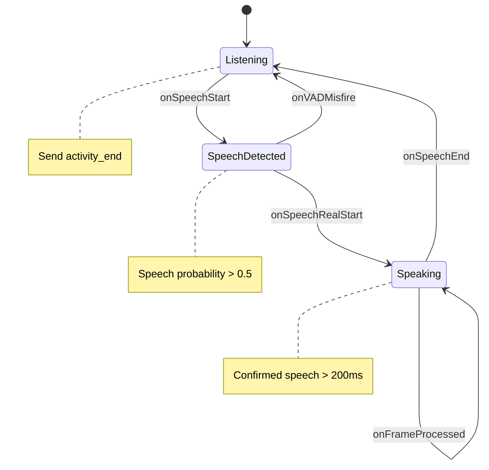

---

## Configuration Reference

### Frontend Constants

| Constant | Value | Description |
|----------|-------|-------------|
| `PRE_SPEECH_BUFFER_MS` | 400ms | Audio captured before speech detection |
| `FLUSH_INTERVAL_MS` | 15000ms | Periodic flush interval for long speech |
| `VAD_SAMPLE_RATE` | 16kHz | Input audio sample rate |
| `VAD_FRAME_SAMPLES` | 512 | Samples per VAD frame (~32ms) |

### Gemini API Configuration

```python
config = {
    "response_modalities": ["AUDIO"],
    "speech_config": {
        "voice_config": {
            "prebuilt_voice_config": {"voice_name": "Aoede"}
        },
        "language_code": "es-US",  # Spanish (US)
    },
    "input_audio_transcription": {},   # Enable input transcription
    "output_audio_transcription": {},  # Enable output transcription
    "realtime_input_config": {
        "automatic_activity_detection": {"disabled": True}  # Manual VAD
    },
}
```

### Audio Formats

| Direction | Format | Sample Rate | Channels |
|-----------|--------|-------------|----------|
| Input (User → Gemini) | PCM 16-bit signed | 16kHz | Mono |
| Output (Gemini → User) | PCM 16-bit signed | 24kHz | Mono |

---

## Quick Decision Guide

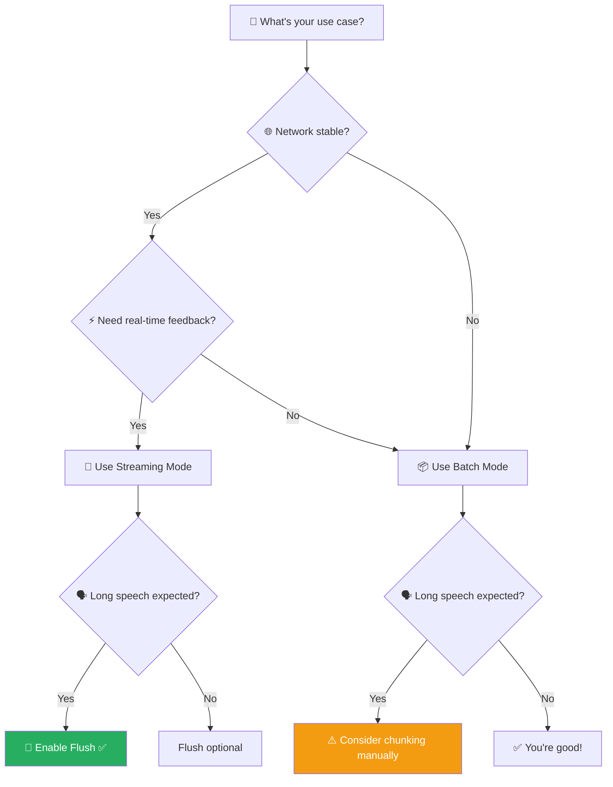

---

## Monitoring & Debugging

The backend logs diagnostic information for debugging audio flow:

```
📊 Audio accumulated: 160.0KB since last activity_end, 5.2s since activity_start
▶️ Sent: activity_start (cycle #3)
⏹️ Sent: activity_end (duration: 8.2s), audio sent: 262.4KB, cycle #3
```

### What to Watch For

| Symptom | Possible Cause | Solution |
|---------|----------------|----------|
| High KB without `activity_end` | User speaking long, no flush | Enable flush mechanism |
| Many cycles in short time | VAD too sensitive | Increase thresholds |
| Turn count warnings (10+) | Session may need refresh | Consider reconnecting |
| Delayed transcriptions | Audio buffer too large | Enable streaming + flush |

---

## Summary

| Feature | Purpose | Default | When to Change |
|---------|---------|---------|----------------|
| **Streaming Mode** | Send audio real-time vs batch | ✅ ON | Unstable network → OFF |
| **Flush Mechanism** | Prevent audio accumulation | ✅ ON | Short utterances only → OFF |
| **Pre-Speech Buffer** | Capture word beginnings | 400ms | Rarely needs change |
| **VAD Sensitivity** | Balance responsiveness vs false positives | 0.5/0.35 | Noisy environment → increase |

---

## Golden Rules 🏆

1. **If users will speak for more than 10-15 seconds continuously**, enable both streaming and flush
2. **Always use the pre-speech buffer** to avoid cutting off word beginnings
3. **Monitor turn counts** - if they climb too high, consider session refresh
4. **Test with real users** - VAD thresholds may need tuning for your environment

---

*Made with ❤️ for developers who want their AI to actually listen*
